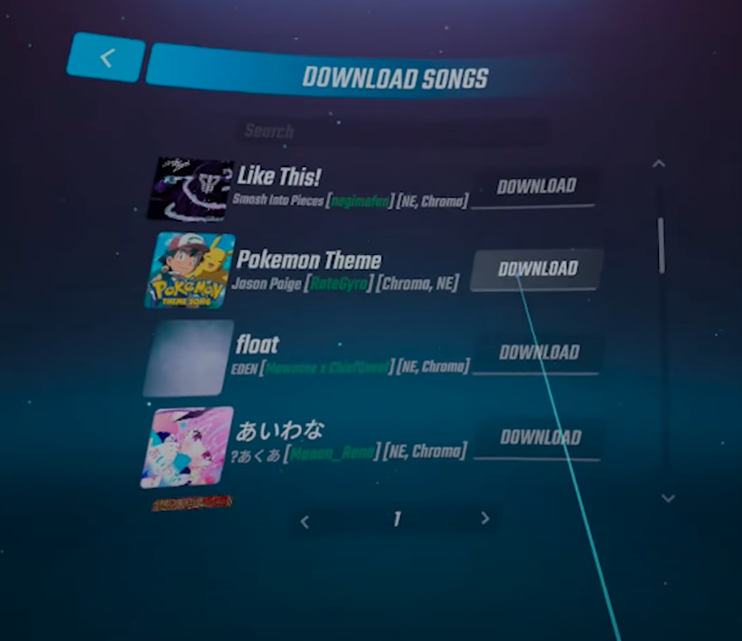
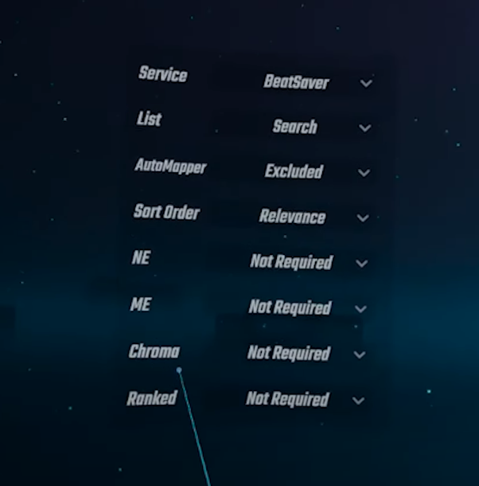

# To find the downloads for mods go to this site. 
[https://computerelite.github.io/tools/Beat_Saber/questmods.html](https://computerelite.github.io/tools/Beat_Saber/questmods.html)
This site has downloads to most mods on supported versions.

To add these mods to your game you can either use the web installer shown below or download the mods by opening that website in the browser tab inside in BMBF.

# If the web interface does not load then try these steps.

### Make sure you are typing the ip from the tools tab in the quest into your browser before trying this below

- BMBF is open in the headset
- There is http:// at the beginning of the link, not https://
- You have :50000 at the end of your link
- Your pc and your quest are on the same Wifi
- Your ip hasn't changed, as it changes from time to time
- Your ip is not 127.0.0.1
### If none of these work restart your quest and try them all again

***

- Once the mod is in bmbf look in the mods tab to check that it was added successfully and that the mod is toggled on.
- After this make sure to click "sync to beatsaber" in the top right of bmbf

---

# songs 
- Songs will stay between versions (click restore playlists when changing versions)
- If you try and play a song and the play button is grey you may need some mods to play it, look in the top right on that song for a **blue question mark**. This will show you what mods are needed to play this song read: [(Grey play buton)](/mod_setup_and_troubleshooting/grey_play_button.md)

# To add songs to your game you can use a few different methods

## The in game song downloader
This is the simplest method of adding songs to your game, you can open this by looking to your left in the main menu and clicking "song downloader" will bring you into a menu that looks like this:

At the top of this page you can see a search bar, you can type the name of the song you want to download there. You can also add filters to this list to show only songs that use noodle extensions, or filter only ranked songs.

****
## The bmbf web interface.

You can get songs and playlists from a few places.
- [(Beastsaber)](https://bsaber.com/)  This is better for playlists and songs of quality.
- [(Beatsaver)](https://beatsaver.com/) This has litteraly every song uploaded but thats both a good and bad thing.
- [(Beatsage)](https://beatsage.com/) This is a webiste you can use to auto generate songs, these songs are often not the best quality. 

### To add these songs or playlists you can drag the files into the bmbf web interface shown below, for playlists you can use `.bplist` or `.json` files, for songs you can use `.zip` files.

### More on beatsage
- Beat Sage is an AI map generator that will create "good enough" maps when given a music file or song link. 
- In terms of the quality, it's basically the McDonald's of mapping. While generally "playable" in an academic sense and has its uses, they don't offer much in terms of actual fun factor/feeling/soul of the map. 
- Beat sage should be used as a last resort if the song you want to play exists nowhere else.

****
## Downloading inside bmbf
- To download songs you can open [(Beastsaber)](https://bsaber.com/) or [(Beatsaver)](https://beatsaver.com/) Inside the browser tab of bmbf
- Once this website is open simply download any songs you want and they will be automatically added to your game.
- You can also download playlists the same way

****
## Syncsaber

****
## The song folder
- One other method is to place the songs in the song folder manualy, this is useful if you are transfering songs from the pc version of the game.
- You can find the song folder at`sdcard/moddata/com.beatgames.beatsaber/mods/songloader/customlevels`
- This song folder can also be backed up to your computer if you are going to factory reset.

****
[(Home)](home.md)
