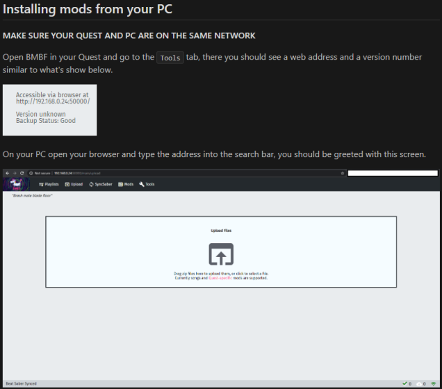

# To find the downloads for mods go to this site. 
[https://computerelite.github.io/tools/Beat_Saber/questmods.html](https://computerelite.github.io/tools/Beat_Saber/questmods.html)
This site has downloads to most mods on supported versions.

To add these mods to your game you can either use the web installer shown below or download the mods by opening that website in the browser tab inside of BMBF.

# If the web interface does not load then try these steps.

### Make sure you are typing the ip from the tools tab in the quest into your browser before trying this below

- BMBF is open in the headset
- There is http:// at the beginning of the link, not https://
- You have :50000 at the end of your link
- Your pc and your quest are on the same Wifi
- Your ip hasn't changed, as it changes from time to time
- Your ip is not 127.0.0.1
### If none of these work restart your quest and try them all again
---
# 

